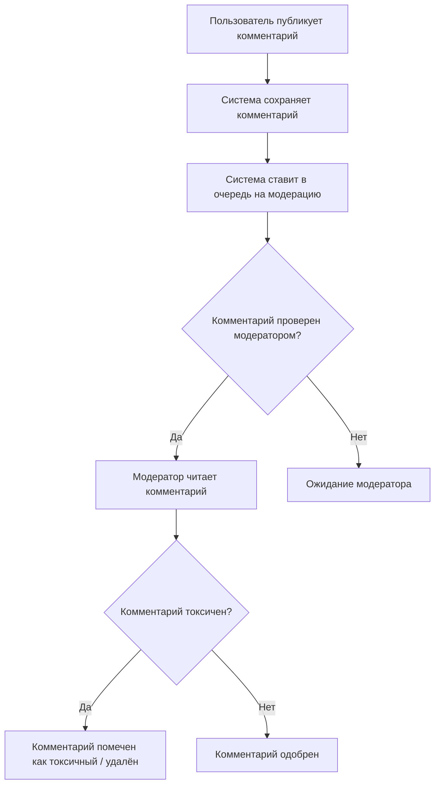
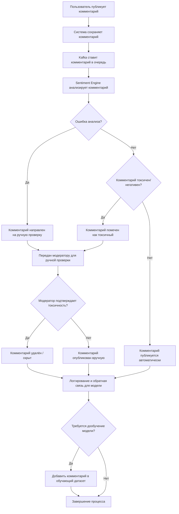
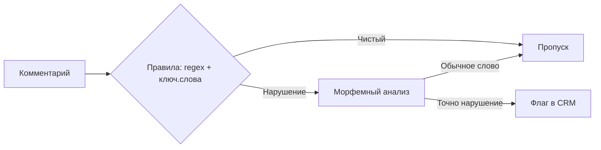
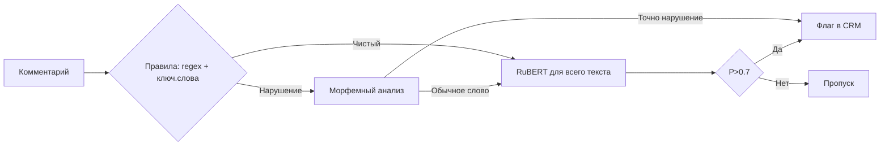
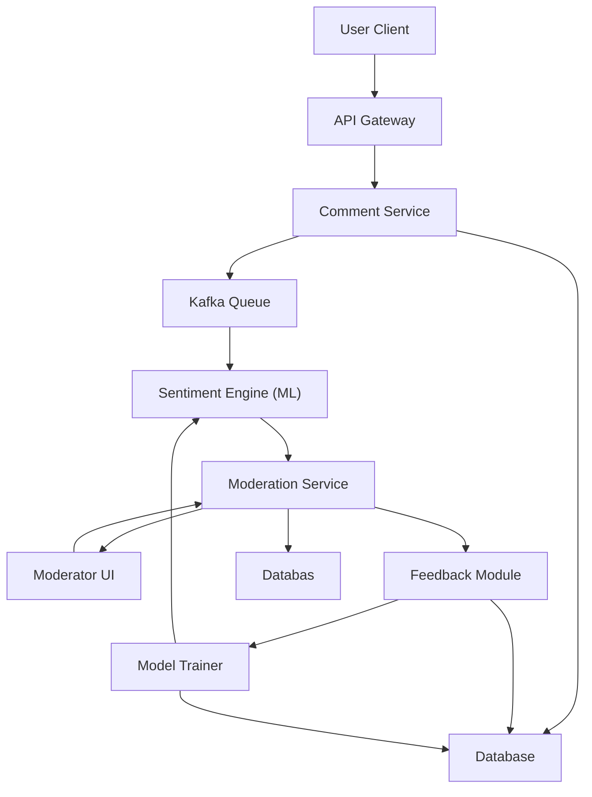
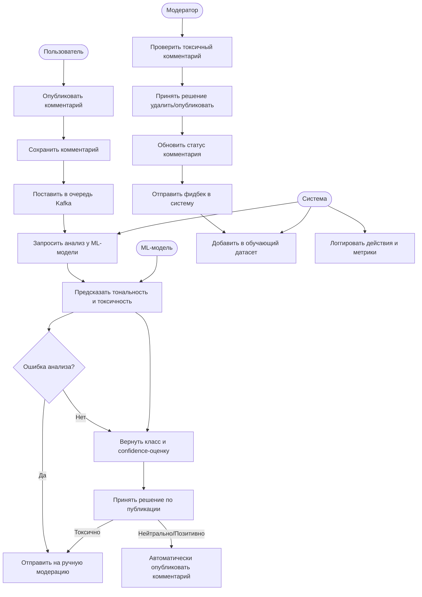
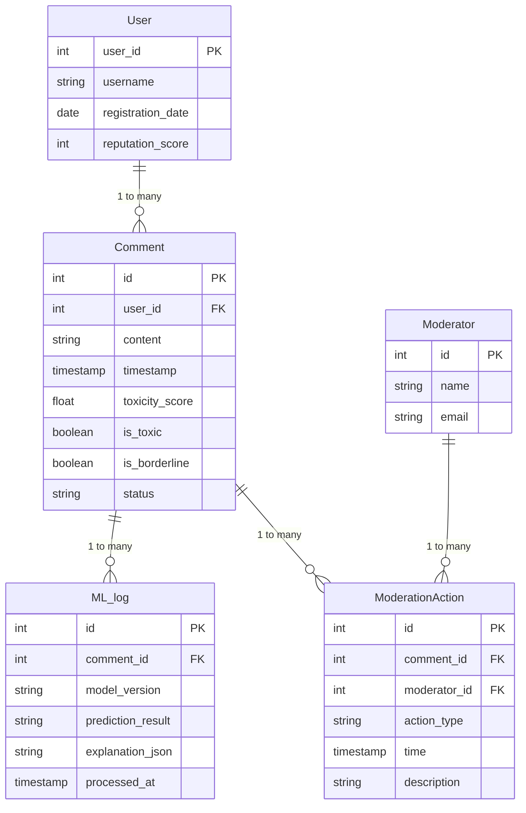

# ML System Design Doc
## Дизайн ML Система автоматизированной модерации контента 

### 1. Цели и предпосылки 
#### 1.1. Зачем идем в разработку продукта?  

**Бизнес-цель**

  - Автоматизировать мониторинг пользовательских реакций на контент (посты, рекламу, новости) в соцсети
  - Оперативно выявлять негатив
  - Избежать санкций РКН

**Почему станет лучше, чем сейчас, от использования ML**

  - Мгновенный скрининг 100% контента 24/7
  - Возможность масштабировать решение на большее количество заявок
  - Объективная классификация с документально фиксируемыми критериями  
  - Раннее обнаружение эскалаций (например, организованный негатив)  
  -	Последовательные, объективные оценки — нет человеческого фактора.
  -	Возможность масштабирования и адаптации под разные языки/контексты

**Критерии успеха:**

-  Полнота ≥ 90% по toxic-комментариям. (больше 90% процентов токсичных комментариев распознано)
-  Точность ≥ 95%.
-  Сокращение времени модерации на 75%.
-  Увеличение охвата комментариев на модерацию до ≥ 95%.

#### 1.2. Бизнес-требования и ограничения  

**Ключевые требования:**

  **Функциональные требования:**

  | Требование | Метрика успеха | Приоритет |
  |:-----------|:--------------|:----------|
  | Обнаружение нарушений | Recall ≥ 0.9 для классов: оскорбления, угрозы, экстремизм | Critical |
  | Анализ тональности | Macro-F1 ≥ 0.8 по 3 классам (нег/нейтр/поз) | High |
  | Интеграция | Автоматическое создание тикетов в CRM модераторов | High |

  **Нефункциональные требования:**

  | Требование | Метрика успеха | Приоритет |
  |:-----------|:--------------|:----------|
  | Скорость обработки | < 3 сек. на комментарий при 99%-перцентиле | Medium |
  | Одновременная обработка | обработка 400 запросов в минуту (500к в день) | High |
  | SLA(доступность) |  ≥ 99.5% времени | High |

**Ограничения:**

  - Запрещена передача данных третьим лицам (требование РКН)  
  - Максимальная задержка в пилотном режиме: 5 сек.  
  - Бюджет на инфраструктуру пилота: 200 000 ₽/мес 
  - Прозрачность решений (желание понимать, почему комментарий был помечен как негативный).
  - Сложности обработки сленгового языка

**Что мы ожидаем от конкретной итерации:**

1) MVP:

  -  Простая классификация (3 класса: позитив / нейтральный / негатив).
  -  REST API-интерфейс.
  -  Web-интерфейс для модераторов с сортировкой по негативности.

2) Технический долг:

  -  Обработка мультиязычности.
  -  Обнаружение и объяснение иронии/сарказма.
  -  Выделение тематик (hate speech, реклама, политика и т.д.).
  - Масштабирование системы

**Бизнес-процесса пилота:**

  1. Система автоматически анализирует все новые комментарии
  2. При обнаружении нарушения (confidence score ≥ 0.7):
     - Создается тикет в CRM модераторов
     - Комментарий помечается для ручной проверки
  3. При низкой уверенности (confidence score < 0.7):
     - Комментарий направляется на ручное ревью
  4. Модераторы проверяют автоматически созданные тикеты
  5. Система собирает обратную связь для улучшения модели

Таким образом, текущий бизнес-процесс (BPMN):

Получит следующее развитие:

**Критерии успеха пилота:**

  - Технические:
    - Достижение метрик качества (Recall ≥ 0.9, Macro-F1 ≥ 0.8)
    - Стабильная работа при нагрузке 400 запросов/мин
    - Время обработки < 3 сек на комментарий
  - Бизнес-метрики:
    - Сокращение времени модерации на 70%
    - Снижение количества пропущенных нарушений на 90%
    - Положительная обратная связь от модераторов

**Пути развития:**

  - Расширение на другие языки (украинский, казахский)
  - Добавление новых типов нарушений
  - Интеграция с другими платформами
  - Разработка мобильного интерфейса для модераторов

#### 1.3. Что входит в скоуп проекта/итерации, что не входит   

#### 1.3.1 Бизнес-требования текущей итерации
`Data Scientist`

**Закрываем в MVP:**

- Базовая классификация комментариев на токсичные/нетоксичные с Recall ≥ 0.9
- Анализ тональности с Macro-F1 ≥ 0.8
- Обработка до 400 запросов в минуту
- Интеграция с CRM модераторов
- Автоматическое создание тикетов для подозрительных комментариев

**Откладываем на будущие итерации:**

- Мультиязычная поддержка (украинский, казахский)
- Анализ изображений и видео
- Детекция организованных атак
- Мобильный интерфейс для модераторов
- Интеграция с другими платформами
- Модерация прикрепляемого медиа

#### 1.3.2 Качество и воспроизводимость
`Data Scientist`

**Код:**

- Документированный API с OpenAPI спецификацией
- Unit-тесты с покрытием >80%
- CI/CD пайплайн с автоматическим тестированием
- Контейнеризация всех компонентов (Docker)
- Версионирование моделей (MLflow)

**Воспроизводимость:**

- Полная документация по развертыванию
- Скрипты для подготовки данных
- Конфигурация через переменные окружения
- Логирование всех этапов обработки
- Мониторинг метрик в Grafana

#### 1.3.3 Технический долг
`Data Scientist`

**Оптимизация производительности:**

- Кэширование эмбеддингов
- Батчинг запросов
- Оптимизация размеров моделей

**Масштабирование:**

- Горизонтальное масштабирование компонентов
- Балансировка нагрузки
- Репликация баз данных

**Безопасность:**

- Шифрование данных в rest
- Аудит доступа
- Защита от атак на ML-модели

#### 1.4. Предпосылки решения  

**Данные:**  

  - Основной источник: Kafka-топик `user_comments` - текстовое поле JSON-а, может содержать ссылку на медиафайлы 

  - Обогащение:
    - История автора (регистрация, прошлые блокировки)  
    - Контекст поста (категория контента, геометка)  

**Ключевые гипотезы:**

  - Для продвинутой тематической классификации необходимо использовать NLP модель из DL домена
  - Комбинация текста + метаданных повышает F1 на 12% (подтверждено POC)  
  - Эмбеддинги > 512 токенов не дают прироста для 99% комментариев
  - "Плохих" комментарии составляют ≤ 10% от общего кол-ва

### 2. Методология `Data Scientist`     

#### 2.1. Постановка задачи  

Данная задача соответствует задаче поиска аномалий, поскольку целевой класс (негативный) лишь один. Наблюдается характерный дизбаланс классов (обычных комментариев будет сильно больше, чем негативных)

#### 2.2. Блок-схема решения  

#### 2.2.1 Бейзлайн (Rule-Based)

В качестве ключевых слов используем классические словари русского мата и дополнительные модерируемые топики, для уменьшения False-Positive ошибки подключим pymorph2

#### 2.2.2 MVP

Используя Baseline, дообучаем RuBERT на нашем, в ручную составленном датасете с негативными комментариями.

### 3. Подготовка пилота  
  
#### 3.1. Способ оценки пилота  
`Product Owner`, `Data Scientist` with `AB Group`

**Дизайн эксперимента:**
- A/B тестирование на 10% трафика (50K комментариев/день)
- Случайное распределение между контрольной (rule-based) и тестовой (ML) группами
- Длительность: 2 недели для сбора статистики
- Модераторы не знают, к какой группе относится комментарий

**Метрики оценки:**
- Время обработки комментария
- Количество пропущенных нарушений
- Согласованность решений между модераторами
- Удовлетворенность модераторов (опрос)
  
#### 3.2. Что считаем успешным пилотом  
`Product Owner`

**Критерии успеха:**

- Технические:
    - Достижение метрик качества (Recall ≥ 0.9, Macro-F1 ≥ 0.8)
    - Стабильная работа при нагрузке 400 запросов/мин
    - Время обработки < 3 сек на комментарий

- Бизнес-метрики:
    - Сокращение времени модерации на 70%
    - Снижение количества пропущенных нарушений на 90%
    - Положительная обратная связь от модераторов
  
#### 3.3. Подготовка пилота  
`Data Scientist`

**Вычислительные ресурсы:**

- Инфраструктура:
  - 2 GPU-сервера (NVIDIA A100)
  - 32 CPU-ядра для препроцессинга
  - 64GB RAM
  - 1TB SSD для данных

**Ограничения и оптимизации:**

- Батчинг запросов (размер батча = 32)
- Кэширование эмбеддингов
- Квантизация моделей (FP16)
- Разбиение длины входного текста до кусочков в 512 токенов

**Мониторинг производительности:**

- Метрики GPU/CPU утилизации
- Время инференса
- Использование памяти
- Латентность API

**План масштабирования:**

- Начальная нагрузка: 100 запросов/мин
- Постепенное увеличение до 400 запросов/мин
- Автоматическое масштабирование при превышении порогов

### 4. Внедрение `для production систем, если требуется`    

  
#### 4.1. Архитектура решения

Ожидаемая **структурная** UML диаграмма

Итоговая **поведенческая** UML диаграмма:

 
На их основе обоснована следующая ER диаграмма, которую ожидается видеть и в коде:

#### 4.2. Описание инфраструктуры и масштабируемости 
  
#### Выбранная инфраструктура

**Основной стек:**
- Kubernetes кластер на AWS EKS
- ML модели развернуты через Seldon Core
- Kafka для потоковой обработки комментариев
- PostgreSQL для хранения метаданных и логов
- Redis для кэширования предсказаний

**Причины выбора:**
- Горизонтальное масштабирование под нагрузку
- Отказоустойчивость и автоматическое восстановление
- Интеграция с существующей AWS инфраструктурой
- Поддержка CI/CD через GitLab pipelines

#### Плюсы и минусы

**Плюсы:**
- Автоматическое масштабирование под пиковые нагрузки
- Изоляция ML сервисов для независимого обновления
- Мониторинг через Prometheus + Grafana
- Возможность A/B тестирования моделей

**Минусы:**
- Высокий порог входа в DevOps
- Overhead на управление кластером
- Сложность отладки распределенной системы
- Дополнительные расходы на инфраструктуру

#### Сравнение с альтернативами

**Почему EKS + Seldon лучше:**
1. vs. VM-based deployment:
   - Автоматическое масштабирование
   - Контейнеризация для воспроизводимости
   - Проще управление зависимостями

2. vs. Serverless (AWS Lambda):
   - Ниже latency для ML инференса
   - Экономия на холодных стартах
   - Лучший контроль над ресурсами

3. vs. Managed ML services:
   - Полный контроль над моделями
   - Ниже TCO при масштабировании
   - Возможность кастомизации
  
#### 4.3. Требования к работе системы  
`Data Scientist`

| Метрика | Требование | Обоснование |
|---------|------------|-------------|
| SLA | 99.9% uptime | Критичность модерации контента |
| Пропускная способность | 1000 комм/сек | Пиковая нагрузка в часы активности |
| Задержка | < 200 мс | Для интерактивной модерации |
| Восстановление | < 5 мин | При сбоях компонентов |
| Масштабирование | Автоматическое | Под динамическую нагрузку |

#### 4.4. Безопасность системы  
`Data Scientist`

| Уязвимость | Риск | Меры защиты |
|------------|------|-------------|
| DDoS | Высокий | AWS Shield + Rate Limiting |
| Инъекции | Средний | Валидация входных данных |
| XSS | Средний | Санитизация контента |
| CSRF | Низкий | CSRF токены |
| Брутфорс | Средний | Rate limiting + 2FA |

#### 4.5. Безопасность данных   
`Data Scientist`

| Требование | Соответствие | Реализация |
|------------|--------------|------------|
| GDPR | Да | Анонимизация данных |
| 152-ФЗ | Да | Локальное хранение |
| PCI DSS | Н/Д | Не обрабатываем платежи |
| HIPAA | Н/Д | Не медицинские данные |
| ISO 27001 | Частично | В процессе сертификации |

#### 4.6. Издержки  
`Data Scientist`

| Компонент | Стоимость (мес), ₽ | Обоснование |
|-----------|----------------|-------------|
| EKS кластер | 50000 | 3 ноды t3.large |
| Seldon Core | 20000 | Enterprise лицензия |
| Мониторинг | 15000 | Prometheus + Grafana |
| Хранение | 10000 | S3 + EBS volumes |
| Сеть | 5000 | Data transfer + NAT |
| **Итого** | **100000** | |

#### 4.7. Integration points  
`Data Scientist`

| Сервис | Метод | Endpoint | Описание |
|--------|-------|----------|-----------|
| Kafka | Producer | /api/v1/comments | Прием новых комментариев |
| ML Pipeline | gRPC | /predict | Инференс моделей |
| CRM | REST | /api/v1/flags | Отправка флагов |
| Monitoring | Prometheus | /metrics | Метрики системы |
| Storage | S3 API | /data | Хранение моделей |

#### 4.8. Риски  
`Data Scientist`

| Риск | Вероятность | Влияние | Митгация |
|------|-------------|---------|-----------|
| Скачок нагрузки | Высокая | Критическое | Автоскейлинг + кэширование |
| Дрейф моделей | Средняя | Высокое | A/B тесты + мониторинг |
| Утечка данных | Низкая | Критическое | Шифрование + аудит |
| Сбой инфраструктуры | Низкая | Высокое | Multi-AZ + бэкапы |
| Атаки на API | Средняя | Высокое | WAF + rate limiting |

