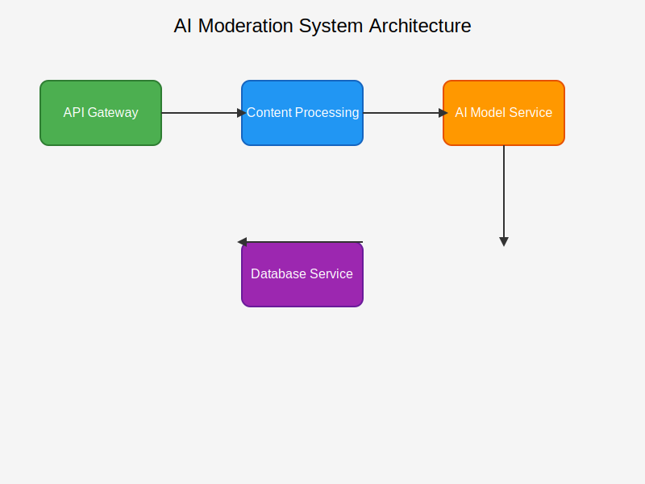

# Welcome to AI Moderation Project Documentation

Welcome to the official documentation for the AI Moderation Project. This documentation will guide you through the installation, configuration, and usage of our AI-powered content moderation system.

## Overview

The AI Moderation Project is designed to help content platforms automatically moderate user-generated content using advanced artificial intelligence techniques. Our system can:

- Detect inappropriate content
- Classify content into different categories
- Provide confidence scores for moderation decisions
- Scale efficiently for high-volume content processing

## Quick Links

- [Installation Guide](getting-started/installation.md)
- [Quick Start Guide](getting-started/quick-start.md)
- [Core Features](features/core-features.md)
- [API Reference](api/overview.md)

## Getting Help

If you need help or have questions, please:

1. Check our [FAQ section](getting-started/faq.md)
2. Review our [troubleshooting guide](getting-started/troubleshooting.md)
3. Open an issue on our GitHub repository

## Contributing

We welcome contributions! Please see our [Contributing Guide](getting-started/contributing.md) for more information.
